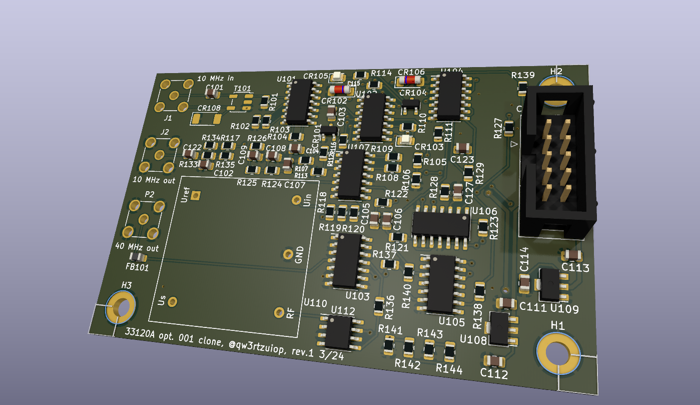

# 33120a-option-001
External reference frequency option for the HP/Agilent/Keysight 33120a arbitrary function generator

The ocxo is a used Vectron C4550A1-0213 (10 MHz, 5V).

Kicad 3d render pic of the rev. 1 PCB. I didnt test this revision.

The PCB is mounted on the side. You need to drill holes into the metal mount the PCB. The pics show the rev. 0 with two bodge wires. 

